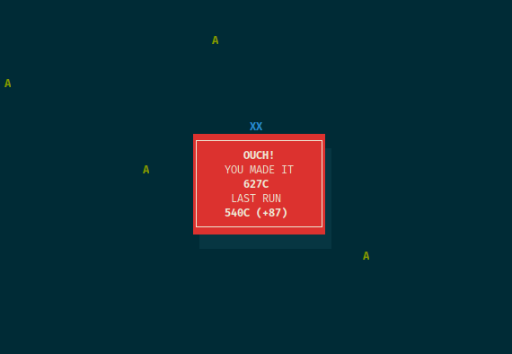

# askii

*An ASCII skiing game based on [SkiFree](http://ski.ihoc.net).*

## Compiling

`make` will compile the game and `sudo make install` will by default copy the game to `/usr/local/bin` (which should be in your `PATH`).

This one-liner should do everything you need: `make && sudo make install && make clean`.

## Configuring

The file `config.h` contains a number of `#defines` which can subtly change the game.

By default the game keeps a file with the last run's score in `/tmp/askii-score`. If you want to make the file persistent, change `FILE_SCORE` (line 5) to something like: `/home/<user>/.askii-score`.

Don't forget to re-compile after making changes.

## Playing

Your score is displayed in the top-right and represents your distance (in *characters*). The further you get, the faster you go. Hitting a tree results in game over.

Use the **arrow keys** left, down and right to move. **P** will pause/un-pause the game and **Q** will quit the game. Press any key after game over to start again.

